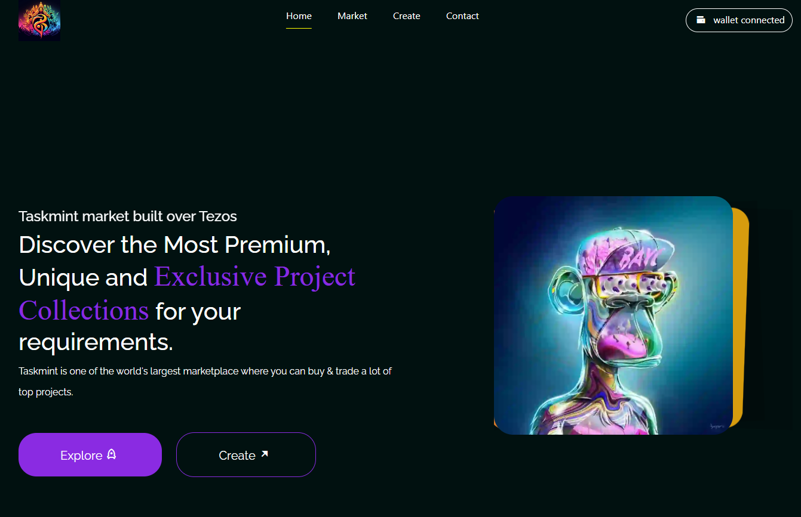

# Project Name: Tezos Project Marketplace

Welcome to the Tezos project Marketplace! This decentralized application (DApp) serves as a platform for users to create, buy, and sell projects on the Tezos blockchain. Below, you will find essential information about the project, including its features, challenges faced during development, and additional resources. Feel free to contribute further on this project.

## Features
- **NFT Creation**: Users can mint their own projects directly on the platform.
- **Marketplace**: A decentralized marketplace where users can list their projects for sale.
- **Wallet Integration**: Seamless integration with Tezos wallets for secure transactions.
- **Blockchain Verification**: All transactions and project ownership records are stored securely on the Tezos blockchain.
- **Responsive Design**: The user interface is optimized for various devices, ensuring a smooth experience across desktop and mobile platforms.

## Challenges Faced
1. **Blockchain Integration**: Integrating Tezos blockchain functionality into the application posed challenges due to its unique architecture and requirements.
2. **Smart Contract Development**: Developing and deploying smart contracts for NFT creation and marketplace operations required careful attention to security and efficiency.
3. **User Experience**: Balancing the complexities of blockchain technology with a user-friendly interface was a significant challenge to ensure accessibility for all users.
4. **Testing**: Ensuring the reliability and security of smart contracts and the platform as a whole required thorough testing methodologies.

## Additional Information
- **Technology Stack**: The project utilizes technologies such as Tezos blockchain, JsLigo, React Js, and NFT storage for decentralized storage.
- **Contact**: For any inquiries or support, please contact our team at nushhush on github.

- ## Images

1. **Homepage**: 

## Demo Video
[Watch the demo video](https://youtu.be/FNvhePWtEQo?si=4NNegZb-nIlGoGsm) to see the Tezos project Marketplace in action!

Thank you for your interest in our project. Happy minting on the Tezos blockchain! 🚀
